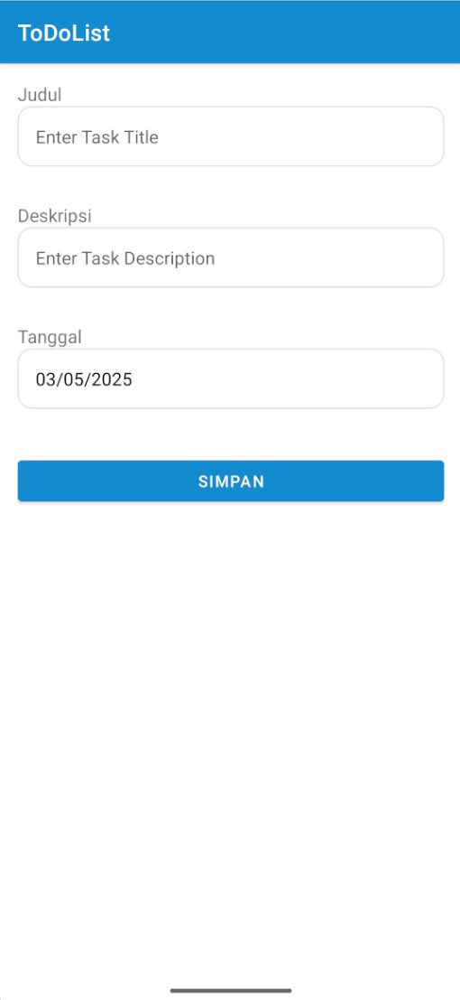

# 📝 TaskMaster - Aplikasi To-Do List Android Modern


## 🌟 Fitur Utama

TaskMaster adalah aplikasi To-Do List modern yang dirancang dengan arsitektur MVVM (Model-View-ViewModel) untuk membantu Anda tetap terorganisir dan produktif.

- ✅ **Manajemen Tugas Lengkap** - Tambah, edit, dan hapus tugas dengan mudah
- 📆 **Pencatatan Tanggal** - Tetapkan tanggal untuk setiap tugas
- 📱 **Antarmuka Intuitif** - UI/UX yang ramah pengguna dan modern
- 🛡️ **Penyimpanan Lokal** - Data disimpan dengan aman menggunakan Room Database
- 🚀 **Performa Tinggi** - Dioptimalkan untuk operasi yang cepat dan responsif

## 📲 Screenshot

<div align="center">
<table>
  <tr>
    <td></td>
    <td></td>
    <td></td>
  </tr>
  <tr>
    <td align="center"><b>Home Todo</b></td>
    <td align="center"><b>Tambah Todo</b></td>
    <td align="center"><b>Edit Todo</b></td>
  </tr>
</table>
</div>

## 🏗️ Arsitektur Aplikasi

TaskMaster menggunakan arsitektur **MVVM (Model-View-ViewModel)** dengan komponen Android Architecture Component:

```
┌───────────────────┐    ┌───────────────────┐    ┌───────────────────┐
│                   │    │                   │    │                   │
│       View        │◄───┤    ViewModel      │◄───┤    Repository     │
│  (Activities)     │    │                   │    │                   │
│                   │    │                   │    │                   │
└───────────────────┘    └───────────────────┘    └─────────┬─────────┘
                                                            │
                                                  ┌─────────▼─────────┐
                                                  │                   │
                                                  │     Room DB       │
                                                  │   (Local Data)    │
                                                  │                   │
                                                  └───────────────────┘
```

### Komponen Utama:

1. **Model** (`ToDoModel.java`):
   - Mendefinisikan entitas data untuk todo dengan anotasi Room
   - Menyimpan properti seperti id, judul, deskripsi, dan tanggal

2. **View** (Activities):
   - `MainActivity.java`: Menampilkan daftar todo dan navigasi
   - `AddTodoActivity.java`: Formulir untuk menambahkan todo baru
   - `EditTodoActivity.java`: Formulir untuk mengedit atau menghapus todo

3. **ViewModel** (`ToDoViewModel.java`):
   - Mengelola data UI dan komunikasi dengan Repository
   - Menyediakan LiveData untuk observasi perubahan data

4. **Repository** (`ToDoRepository.java`):
   - Abstraksi akses data dari berbagai sumber
   - Mengelola operasi database asinkron

5. **Room Database** (`ToDoDatabase.java` & `ToDoDao.java`):
   - Menyediakan akses lokal ke database SQLite
   - Operasi CRUD (Create, Read, Update, Delete) untuk todo

## 📋 Cara Menggunakan

### Menambah Todo Baru:
1. Tekan tombol "+" pada layar utama
2. Masukkan judul, deskripsi, dan tanggal (tanggal hari ini sudah terisi otomatis)
3. Tekan tombol "Simpan"

### Mengedit Todo:
1. Tekan tombol "Edit" pada item todo yang ingin diubah
2. Ubah judul, deskripsi, atau tanggal sesuai keinginan
3. Tekan tombol "Simpan" untuk menyimpan perubahan

### Menghapus Todo:
1. Untuk menghapus langsung dari daftar: Tekan tombol "Hapus" pada item todo
2. Atau, buka layar edit dan tekan tombol "Hapus"

## 🛠️ Teknologi yang Digunakan

- **Java** - Bahasa pemrograman utama
- **Android SDK** - Framework pengembangan aplikasi
- **Room Database** - Abstraksi SQLite untuk penyimpanan data lokal
- **LiveData** - Observable data holder untuk komponen UI
- **ViewModel** - Pengelola data terkait UI yang sadar lifecycle
- **RecyclerView** - Menampilkan daftar data dinamis dengan efisien

## 🚀 Pengembangan Lebih Lanjut

Fitur yang dapat ditambahkan di masa depan:

- [ ] Notifikasi pengingat untuk todo
- [ ] Kategori dan prioritas untuk todo
- [ ] Mode gelap (Dark Mode)
- [ ] Sinkronisasi dengan layanan cloud
- [ ] Widget untuk layar utama Android
- [ ] Pencarian dan filter todo

## 📬 Kontak

Jika Anda memiliki pertanyaan atau saran untuk pengembangan aplikasi ini, silakan hubungi:

- Email: baguswedanta17@gmail.com
- GitHub: github.com/Weedanta
- Website: baguswedanta.my.id

---

<div align="center">
  <p>Made with ❤️ for better productivity</p>
</div>